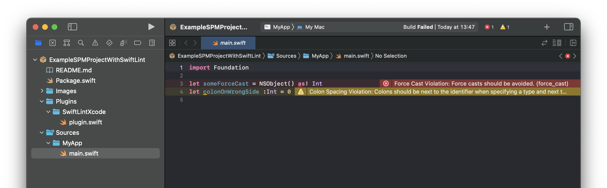

# Example SPM Project With SwiftLint

## How to implement it in your project

1. Check the `Package.swift` file to see how to add SwiftLint to your Swift
   package.

2. Copy the `Plugins/SwiftLintXcode/plugin.swift` file to your project.

3. Done! Build your package with Xcode and SwiftLint will display warnings and
   errors in Xcode.

This is the only way I was able to get it working in Xcode 13.3. Ideally, the
plugin itself could be declared in some shared repository that everyone could
use, so they wouldn't need to manually add swiftlint binary checksums or
implement the plugin. However, I wasn't able to get that working.
